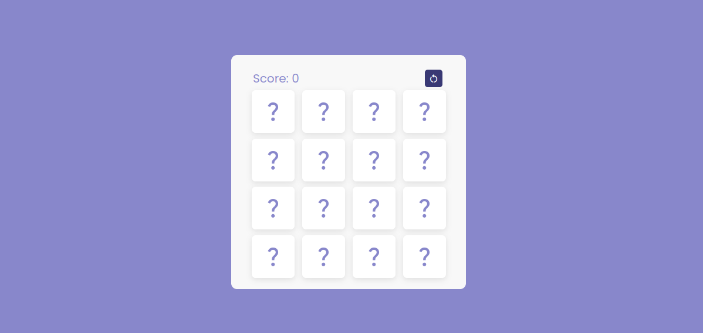

# Memory Card Game



Mais imagens e vídeos: [More](projeto)

## Descrição

Este projeto é um jogo de memória simples onde o jogador deve encontrar pares de cartas correspondentes. O jogo foi desenvolvido utilizando HTML, CSS e JavaScript. O objetivo do jogo é virar duas cartas e encontrar os pares correspondentes até que todas as cartas sejam combinadas.

## Funcionalidades

- **Jogo de Memória**: Clique nas cartas para virá-las e encontrar pares correspondentes.
- **Contagem de Pontos**: A cada par encontrado, a pontuação aumenta. A pontuação é mantida mesmo após a atualização da página.
- **Reiniciar Jogo**: Um botão de reiniciar que zera a pontuação e embaralha as cartas para começar um novo jogo.
- **Feedback Visual**: As cartas não correspondentes tremem antes de virar de volta.

## Estrutura de Arquivos

- `index.html`: Contém a estrutura HTML do jogo.
- `style.css`: Contém os estilos CSS para o layout e design do jogo.
- `script.js`: Contém a lógica do jogo utilizando JavaScript.

## Como Jogar

1. Abra o arquivo `index.html` em um navegador.
2. Clique em uma carta para virá-la.
3. Clique em outra carta para tentar encontrar um par correspondente.
4. Continue virando as cartas até encontrar todos os pares.
5. A pontuação será atualizada conforme você encontrar pares.
6. Para reiniciar o jogo e zerar a pontuação, clique no botão "Reset".

## Código HTML

```html
<!DOCTYPE html>
<html lang="en" dir="ltr">
<head>
    <meta charset="UTF-8">
    <meta name="viewport" content="width=device-width, initial-scale=1.0">
    <title>Memory Card Game</title>
    <link rel="stylesheet" href="style.css">
    <link rel="stylesheet" href="https://fonts.googleapis.com/css2?family=Material+Symbols+Outlined:opsz,wght,FILL,GRAD@20..48,100..700,0..1,-50..200" />
</head>
<body>
    <div class="wrapper">
        <div class="top-bar">
            <div class="score-board">
                <span>Score: </span><span id="score">0</span>
            </div>
            <button id="resetButton">Reset</button>
        </div>
        <ul class="cards">
            <!-- Elementos das cartas -->
        </ul>
    </div>
    <script src="script.js"></script>
</body>
</html>
```

## Código CSS

```css
* {
    margin: 0;
    padding: 0;
    box-sizing: border-box;
    font-family: 'Poppins', sans-serif;
}

body {
    display: flex;
    align-items: center;
    justify-content: center;
    min-height: 100vh;
    background-color: #8887cb;
}

.wrapper {
    height: 400px;
    width: 400px;
    padding: 25px;
    background-color: #f8f8f8;
    border-radius: 10px;
}

.top-bar {
    display: flex;
    justify-content: space-between;
    align-items: center;
    margin-bottom: 20px;
}

.score-board {
    text-align: center;
    font-size: 20px;
    margin-top: -10px;
    margin-left: 2px;
    color: #8887cb;
}

.top-bar button {
    margin-top: -10px;
    margin-right: 5px;
    width: 80px; 
    height: 30px;
    cursor: pointer;
    font-size: 16px; 
    color: #ffffff;
    background-color: #393974;
    border: none;
    border-radius: 5px;
    transition: opacity 0.3s; 
}

.top-bar button:hover {
    opacity: 0.7; 
}

.cards, .card, .view {
    display: flex;
    align-items: center;
    justify-content: center;
}

.cards {
    height: 100%;
    width: 100%;
    flex-wrap: wrap;
    justify-content: space-between;
}

.cards .card {
    cursor: pointer;
    position: relative;
    perspective: 800px;
    transform-style: preserve-3d;
    height: calc(100% / 4 - 10px);
    width: calc(100% / 4 - 10px);
}

.cards .card .view {
    width: 100%;
    height: 100%;
    position: absolute;
    background-color: #fff;
    border-radius: 7px;
    box-shadow: 0 3px 10px rgba(0,0,0,0.1);
}

.card .front-view span {
    font-size: 40px;
    color: #8887cb;
}

.card .back-view {
    transform: rotateY(-180deg);
}

.card .back-view img {
    max-width: 45px;
}

.card:hover .back-view {
    transform: rotateY(0);
}
```

## Código JavaScript

```javascript
//anotações incrementadas no arquivo
const cards = document.querySelectorAll(".card");
const scoreElement = document.getElementById("score");
const resetButton = document.getElementById("resetButton");

let matchedCard = 0;
let cardOne, cardTwo;
let disableDeck = false;
let score = localStorage.getItem('score') ? parseInt(localStorage.getItem('score')) : 0;

function flipCard(e) {
    let clickedCard = e.target.closest(".card"); 
    if (clickedCard !== cardOne && !disableDeck) {
        clickedCard.classList.add("flip");
        if (!cardOne) {
            return cardOne = clickedCard;
        }
        cardTwo = clickedCard;
        disableDeck = true;
        let cardOneImg = cardOne.querySelector("img").src,
            cardTwoImg = cardTwo.querySelector("img").src;
        matchCards(cardOneImg, cardTwoImg);
    }
}

function matchCards(img1, img2) {
    if (img1 === img2) {
        matchedCard++;
        score += 10; 
        updateScore();
        if (matchedCard == 8) {
            setTimeout(() => {
                shuffleCard();
            }, 1000);
        }
        cardOne.removeEventListener("click", flipCard);
        cardTwo.removeEventListener("click", flipCard);
        cardOne = cardTwo = "";
        disableDeck = false;
    } else {
        setTimeout(() => {
            cardOne.classList.add("shake");
            cardTwo.classList.add("shake");
        }, 400);

        setTimeout(() => {
            cardOne.classList.remove("shake", "flip");
            cardTwo.classList.remove("shake", "flip");
            cardOne = cardTwo = "";
            disableDeck = false; 
        }, 1200);
    }
}

function shuffleCard() {
    matchedCard = 0;
    cardOne = cardTwo = "";
    disableDeck = false; 
    let arr = [1, 2, 3, 4, 5, 6, 7, 8, 1, 2, 3, 4, 5, 6, 7, 8];
    arr.sort(() => Math.random() > 0.5 ? 1 : -1);

    cards.forEach((card, index) => {
        card.classList.remove("flip");
        let imgTag = card.querySelector("img");
        imgTag.src = `images/img-${arr[index]}.png`;
        card.addEventListener("click", flipCard);
    });
}

function updateScore() {
    scoreElement.textContent = score;
    localStorage.setItem('score', score);
}

function resetGame() {
    score = 0; 
    updateScore();
    shuffleCard(); 
}

resetButton.addEventListener("click", resetGame);

updateScore();
shuffleCard();

cards.forEach(card => {
    card.addEventListener("click", flipCard);
});
```

## Licença

Este projeto é de uso livre e aberto para todos. Sinta-se à vontade para clonar, modificar e usar o código conforme necessário. Se você encontrar bugs ou tiver sugestões de melhorias, não hesite em contribuir.
