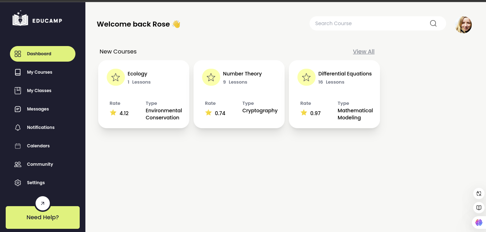

# Dashboard Educacional

  

Este projeto é um **Dashboard Educacional** em desenvolvimento. O objetivo principal do projeto é criar uma plataforma que exiba:  

- **Atividades realizadas:** Para acompanhar o progresso dos usuários.  
- **Novos cursos:** Para destacar oportunidades de aprendizado.  
- **Calendários:** Para organizar prazos e compromissos.  
- Outros recursos que promovam uma experiência educacional completa.

## Status do Projeto  
Atualmente, o layout inicial do dashboard foi desenvolvido, incluindo o campo de navegação. Este é apenas o começo, e ainda há muito trabalho pela frente para implementar todas as funcionalidades desejadas.  

O projeto é um desafio significativo e está sendo usado como uma oportunidade para:  
- Explorar novos conceitos e técnicas do **React**.  
- Demonstrar as habilidades que venho adquirindo nos meus estudos.  

## Tecnologias Utilizadas  
- **React**: Biblioteca principal para a construção da interface.  
- **Tailwindcss**
- 
## Objetivo Pessoal  
Este projeto faz parte do meu portfólio e tem como objetivo mostrar minhas habilidades e evolução no desenvolvimento de aplicações front-end.  

## Atualizações  
O README será atualizado conforme novos recursos forem adicionados ou concluídos.  

Sinta-se à vontade para acompanhar o progresso deste projeto!  

---  
**Progresso atual:**  
- [x] Layout do dashboard criado  
- [x] Campo de navegação implementado  
- [ ] Integração de gráficos 
- [x] Implementação da seção de novos cursos  
- [ ] Funcionalidade do calendário  
- [ ] Testes e ajustes finais  

---  
**Autor:** Eloísa Martins  

