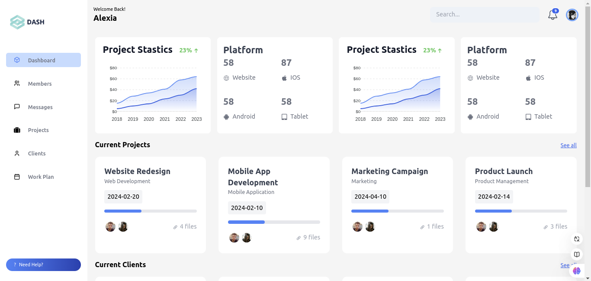

# Dashboard 

 


Este projeto é um **dashboard interativo** em React, criado com as tecnologias **Vite**, **Vue**, **React**, **Tailwind CSS** e **ApexCharts**. O objetivo principal deste projeto é fornecer uma visualização de dados dinâmicos e interativos, como gráficos, além de exibir informações de usuários aleatórios com base em uma API externa. Ele é **responsivo**, permitindo uma experiência de usuário otimizada em dispositivos móveis e desktop.

### Funcionalidades

- **Gráficos interativos:** Utiliza **ApexCharts** para renderizar gráficos de área, permitindo a visualização de dados de maneira dinâmica.
- **API de usuários aleatórios:** Os dados dos usuários são carregados dinamicamente de uma API externa, oferecendo uma simulação de um dashboard de usuários reais.
- **Layout responsivo:** O projeto se adapta a diferentes tamanhos de tela, com uma interface intuitiva e fluida.
- **Estrutura modular:** Com base na estrutura padrão de um projeto React, o código é organizado em componentes reutilizáveis e páginas.

### Tecnologias

- **React:** A biblioteca principal para a construção da interface de usuário.
- **Vite:** Usado para a construção e bundling do projeto, proporcionando uma experiência de desenvolvimento rápida.
- **Vue:** Um framework para integração, trazendo funcionalidades dinâmicas e componentes reutilizáveis.
- **Tailwind CSS:** Para estilização, garantindo um design moderno e responsivo com classes utilitárias.
- **ApexCharts:** Para criar gráficos interativos e visuais detalhados, como o gráfico de área mostrado no projeto.
- **API de usuários aleatórios:** Utilizada para obter dados de usuários para exibição dinâmica.

### Estrutura do Projeto

O projeto é organizado com a seguinte estrutura de arquivos:

```
/src
  /components
    - ClientCard.js
    - Header.js
    - Layout.js
    - MemberCard.js
    - Platforms.js
    - ProjectCard.js
    - ProjectStatistics.js
    - SideBar.js
  /pages
    - Home.js
    - Members.js
  - App.js
  - index.css
  - main.js
```

### Funcionalidade do Componente `ProjectStatistics`

Este componente é responsável por exibir o gráfico de área utilizando **ApexCharts**. Abaixo, a estrutura de como ele é renderizado:

```javascript
import { useEffect, useRef } from "react";

// Componente principal que exibe estatísticas de vendas e um gráfico de área
const ProjectStatistics = () => {
  const options = {
    series: [
      {
        name: "Developer Edition",
        data: [5, 10, 14, 23, 30, 42],
        color: "#1A56DB",
      },
      {
        name: "Designer Edition",
        data: [15, 28, 34, 41, 58, 64],
        color: "#508FF4",
      }
    ],
    chart: {
      height: "100%",
      maxWidth: "100%",
      type: "area",
      fontFamily: "Inter, sans-serif",
      dropShadow: { enabled: false },
      toolbar: { show: false },
    },
    tooltip: { enabled: true, x: { show: false } },
    legend: { show: false },
    fill: {
      type: "gradient",
      gradient: { opacityFrom: 0.55, opacityTo: 0, shade: "#1C64F2", gradientToColors: ["#1C64F2"] },
    },
    stroke: { width: 2 },
    grid: { show: true, strokeDashArray: 4 },
    xaxis: { categories: ["2018", "2019", "2020", "2021", "2022", "2023", "2024"] },
    yaxis: { show: true, labels: { formatter: function (value) { return "$" + value; } } },
  };

  const chartRef = useRef(null);

  useEffect(() => {
    if (chartRef.current && typeof ApexCharts !== "undefined") {
      const chart = new ApexCharts(chartRef.current, options);
      chart.render();
      return () => chart.destroy();
    }
  }, [options]);

  return (
    <div>
      <div className="w-full bg-white rounded-lg p-4 md:p-5">
        <div className="flex justify-between">
          <h5 className="leading-none text-2xl font-bold text-gray-900 pb-1">
            Project Statistics
          </h5>
        </div>
        <div ref={chartRef} id="data-series-chart"></div>
      </div>
    </div>
  );
};

export default ProjectStatistics;
```

### Como Rodar o Projeto

1. Clone o repositório:
   ```bash
   git clone https://github.com/Heloizh/JavaScript.git
   ```

2. Navegue até a pasta do projeto:
   ```bash
   cd react
   cd dashboard
   ```

3. Instale as dependências:
   ```bash
   npm install
   ```

4. Inicie o servidor de desenvolvimento:
   ```bash
   npm run dev
   ```

O projeto estará disponível em `http://localhost:5174`.

### Melhorias Futuras

- **Integração com mais APIs**: Adicionar funcionalidades com diferentes fontes de dados.
- **Melhoria no design**: Refinar o layout e a responsividade para uma melhor experiência de usuário.
- **Autenticação**: Implementar uma funcionalidade de login para um ambiente mais seguro e dinâmico.

