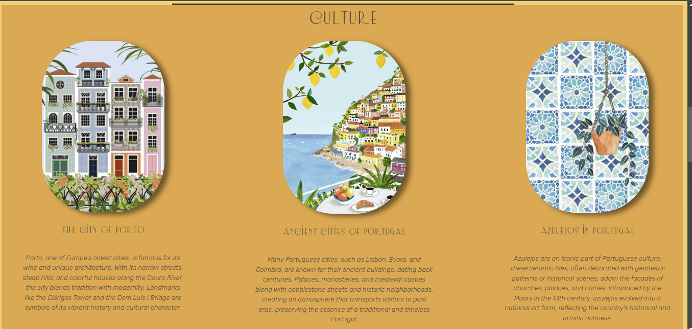

# Portugal Cultural Page

  
*Descrição da imagem do projeto*

[Vídeo de demonstração do projeto](https://youtu.be/EVdiY3VtEgE)  
*Descrição do vídeo de demonstração*

Este projeto é um website desenvolvido em React, com o objetivo de apresentar um pouco da rica cultura de Portugal. Ele foi criado para demonstrar minhas habilidades em desenvolvimento web, focando em funcionalidades e interações entre as páginas.

## Visão Geral

O site é composto por várias páginas, cada uma abordando um aspecto específico da cultura portuguesa. As páginas principais são:

- **Homepage:** Página inicial com uma visão geral do site.
- **HitoryPage:** Página dedicada à história de Portugal.
- **CulturePage:** Focada em mostrar aspectos culturais, como tradições, arte e folclore.
- **MusicPage:** Uma página interativa sobre a música de Portugal, com playlists e informações dinâmicas sobre diferentes músicas e instrumentos.
- **AttractionsPage:** Página com informações práticas e dicas para visitantes e interessados em conhecer mais sobre Portugal.

## Funcionalidades

- **Navegação Dinâmica:** Cada botão leva a uma página correspondente com animações suaves ao rolar e transições entre as seções.
- **Interatividade:** Na página de música, é possível selecionar diferentes playlists, e ao clicar em uma música, o título e o cartão com detalhes se atualizam dinamicamente.
- **Design Responsivo:** O layout se ajusta para proporcionar uma boa experiência em diferentes dispositivos.

## Código Exemplo

Abaixo está um exemplo do código principal do projeto, que utiliza React:

```javascript
import React, { useState } from 'react';
import './App.css';

// Importando componentes JSX
import HomePage from './components/HomePage';
import NavBar from './components/NavBar';
import HistoryPage from './components/HistoryPage';
import CulturePage from './components/CulturePage';
import FoodPage from './components/FoodPage';
import MusicsPage from './components/MusicsPage';
import AttractionsPage from './components/AttractionsPage';
import DynamicHistoryPage from './dynamic_components/DynamicHistoryPage';
import DynamicCulturePage from './dynamic_components/DynamicCulturePage';
import DynamicFoodPage from './dynamic_components/DynamicFoodPage';

function App() {
  const [showDynamicPage, setShowDynamicPage] = useState(false); // Controla a visibilidade das páginas dinâmicas
  const [activeElement, setActiveElement] = useState('musics'); // Controla o elemento de mídia ativo
  const [currentMedia, setCurrentMedia] = useState(null); // Armazena a mídia selecionada

  const handleShowDynamicPage = () => {
    setShowDynamicPage(true); // Exibe a página dinâmica ao clicar no botão
  };

  const handleCloseDynamicPage = () => {
    setShowDynamicPage(false); // Fecha a página dinâmica
  };

  const handleSelectMedia = (mediaSrc) => {
    setCurrentMedia(mediaSrc); // Define a fonte de mídia atual
  }

  return (
    <div className='main'>
      <HomePage />
      <hr />
      <NavBar />
      <hr />
      <HistoryPage onButtonClick={handleShowDynamicPage} />
      {showDynamicPage && (
        <div>
          <div className='overlay'></div>
          <div className='modal'>
            <DynamicHistoryPage onClose={handleCloseDynamicPage} />
          </div>
        </div>
      )}
      <hr className='hr' />
      <CulturePage onButtonClick={handleShowDynamicPage} />
      {showDynamicPage && (
        <div>
          <div className='overlay'></div>
          <div className='modal'>
            <DynamicCulturePage onClose={handleCloseDynamicPage} />
          </div>
        </div>
      )}
      <hr className='hr' />
      <FoodPage onButtonClick={handleShowDynamicPage} />
      {showDynamicPage && (
        <div>
          <div className='overlay'></div>
          <div className='modal'>
            <DynamicFoodPage onClose={handleCloseDynamicPage} />
          </div>
        </div>
      )}
      <hr className='hr' />
      <MusicsPage activeElement={activeElement} setActiveElement={setActiveElement} />
      <hr className='hr' />
      <AttractionsPage />
    </div>
  );
}

export default App;
```

## Como Rodar o Projeto

1. **Pré-requisitos:** Certifique-se de que você tenha o [Node.js](https://nodejs.org/) e o [npm](https://www.npmjs.com/) instalados em seu computador.

2. **Clone o repositório:**
   ```bash
   git clone https://github.com/Heloizh/JavaScript.git
   ```

3. **Instale as dependências:**
   ```bash
   cd portugal-website-react
   npm install
   ```

4. **Inicie o servidor local:**
   ```bash
   npm start
   ```

O projeto estará rodando em [http://localhost:5173/](http://localhost:5173/).

## Objetivo

Este projeto tem como foco principal demonstrar minhas habilidades em React, como a implementação de componentes reutilizáveis, manipulação de estado, e funcionalidades interativas, como a atualização dinâmica de conteúdo a partir da interação do usuário com os botões e listas.

## Tecnologias Utilizadas

- **React.js**
- **CSS para estilização**
- **JavaScript para funcionalidades**
- **React Router para navegação**

