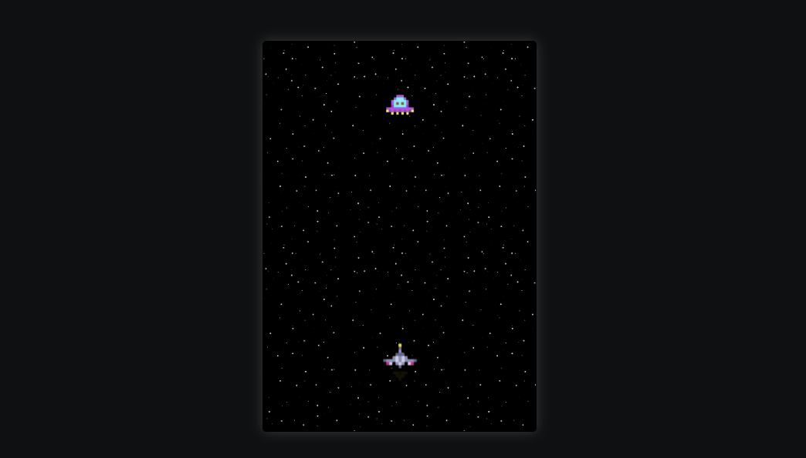
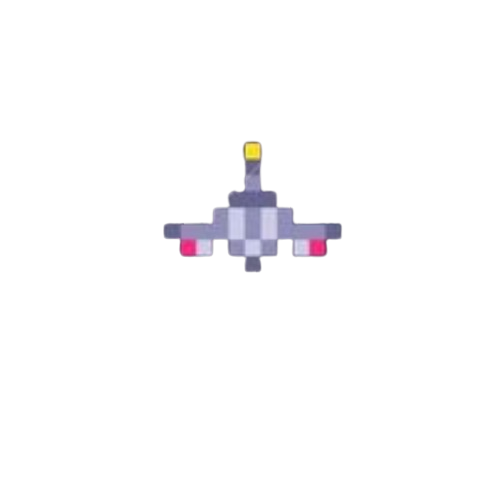
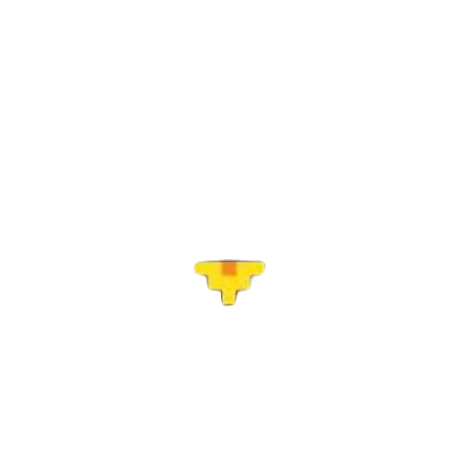
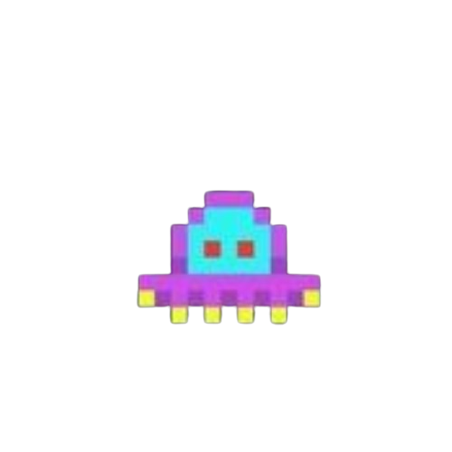
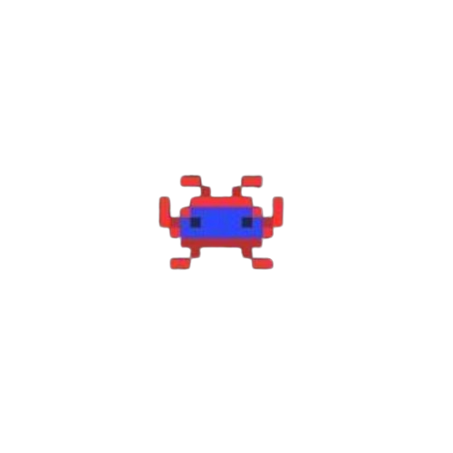
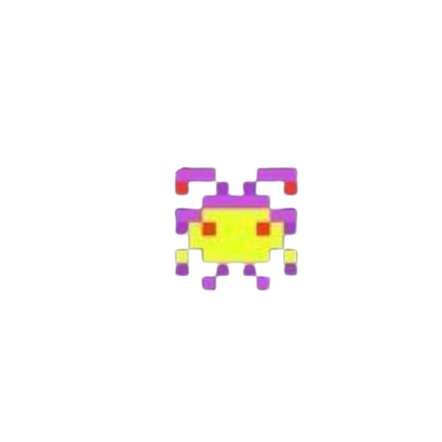

# Espaço

Imagem protótipo-> 

Mais imagens e vídeos -> [More](projeto)

## Descrição

Espaço é um jogo desenvolvido em HTML, CSS e JavaScript onde o objetivo principal é derrotar os inimigos no espaço. O jogador controla uma nave que tem a capacidade de atirar e derrotar inimigos enquanto coleta vidas, pontos e moedas.

## Estado do Desenvolvimento

O jogo está atualmente em desenvolvimento. As funcionalidades básicas foram implementadas, incluindo a movimentação da nave, a capacidade de atirar, e a contagem de vidas, pontos e moedas. No entanto, o projeto ainda não está completo e necessita de melhorias adicionais.

## Funcionalidades

- **Movimentação da Nave**: A nave pode ser movida para a esquerda e direita usando as setas do teclado.
- **Tiro**: A nave pode atirar usando a barra de espaço.
- **Contagem de Vidas, Pontos e Moedas**: O jogo mantém a contagem de vidas, pontos e moedas coletadas.

## Tecnologias Utilizadas

- HTML
- CSS
- JavaScript

## Estrutura do Código

### HTML

```html
<!DOCTYPE html>
<html lang="en" dir="ltr">
<head>
    <meta charset="UTF-8">
    <meta name="viewport" content="width=device-width, initial-scale=1.0">
    <!--fonts-->
    <link rel="preconnect" href="https://fonts.googleapis.com">
    <link rel="preconnect" href="https://fonts.gstatic.com" crossorigin>
    <link href="https://fonts.googleapis.com/css2?family=Play:wght@400;700&family=Poppins:ital,wght@0,100;0,200;0,300;0,400;0,500;0,600;0,700;0,800;0,900&display=swap" rel="stylesheet">
    <link rel="stylesheet" href="style.css">
    <title>Space Game</title>
</head>
<body>
    <div class="wrapper">
        <div class="tamplate">
            <!--nave principal-->
            
            
            
            <!--inimigos-->
            
            
            
        </div>    
    </div>
<script src="script.js"></script>
</body>
</html>
```

### CSS

```css
* {
    margin: 0;
    padding: 0;
    box-sizing: border-box;
}

body {
    display: flex;
    align-items: center;
    justify-content: center;
    min-height: 100vh;
    overflow: hidden;
    background-color: #0f1011;
}

/*configurando imagem de fundo*/
.wrapper {
    position: relative;
    height: 500px;
    width: 350px;
    display: flex;
    overflow: hidden;
    border: 1px solid black;
    border-radius: 5px;
    box-shadow: 0 0 15px rgba(158, 155, 155, 0.3);
}

.tamplate {
    background-image: url('images/img1-fundo.jpeg');
    background-position: 0 0;
    background-size: 140px;
    width: 100%;
    display: flex;
    justify-content: center;
    align-items: center;
    animation: move 4s linear infinite forwards;
}

@keyframes move {
    0% {
        background-position: center 0 ;
    }
    100% {   
        background-position: center 100%;
    }
}   

/*configurando a nave e o fogo da nave*/
.square-nave {
    position: absolute;
    bottom: 5%;
    width: 35%;   
}

#nave {
    z-index: 1;
}

/*animação do fogo da nave*/
#fire-nave {
    animation: blink 0.4s infinite;
}

@keyframes blink {
    0%, 100% {
        opacity: 1;
    }
    50% {
        opacity: 0;
    }
}

/*configuração dos tiros*/
#shots {
    width: 25%;
    bottom: 15%;
    display: none;
    animation: toappear 0.2s infinite linear;
}

@keyframes toappear {
    0%, 100% {
        bottom: 17%;
    }
    25% {
        bottom: 30%;
    }
    50% {
        bottom: 50%;
    }
    100% {
        bottom: 84%;
    }    
}

/*enemy*/
.enemy {
    position: absolute;
    width: 25%;
    animation: monster-animation 10s linear infinite forwards;
} 

@keyframes monster-animation {
    from {
        top: -25%;
    }
    to {
        top: 100%;
    }
}

/*efeito de clareamento*/
.light-up {
    background-color: rgba(255, 255, 255, 0.5);
    transition: background-color 0.2s ease;
}

#character2 {
    display: none;
}

#character3 {
    display: none;
}
```

### JavaScript

```javascript
document.addEventListener('DOMContentLoaded', () => {
    //CÓDIGO DA NAVE
    //Seleciona elementos do DOM 
    const nave = document.getElementById('nave');
    const fire_nave = document.getElementById('fire-nave');
    const shots = document.getElementById('shots');
    const wrapper = document.querySelector('.wrapper');
    const steps = 20; //Passos em pixels para mover a nave

    //Inicializa as posições horizontais da nave e dos tiros
    let leftPositionNave = (wrapper.clientWidth - nave.offsetWidth) / 2;
    let leftPositionFire = (wrapper.clientWidth - fire_nave.offsetWidth) / 2;
    let isSpacePressed = false; //Flag para verificar se a tecla space está pressionada
    let isShotsAtLimit = false; //Flag para verificar se os tiros atingiram o limite do contêiner

    // Definindo a posição inicial em pixels
    nave.style.left = `${leftPositionNave}px`;
    fire_nave.style.left = `${leftPositionFire}px`;

    // Definindo as funcionalidades do teclado ao pressionar as teclas de seta
    document.addEventListener('keydown', (e) => {
        if (e.key === 'ArrowRight') {
            leftPositionNave += steps;
            leftPositionFire += steps;
        } else if (e.key === 'ArrowLeft') {
            leftPositionNave -= steps;
            leftPositionFire -= steps;
        }

        // Limita a posição do elemento em relação ao container
        leftPositionNave = Math.max(-30, Math.min(leftPositionNave, wrapper.clientWidth - nave.offsetWidth + 30));
        leftPositionFire = Math.max(-30, Math.min(leftPositionFire, wrapper.clientWidth - fire_nave.offsetWidth + 30));

        // Atualiza a posição da nave em pixels
        nave.style.left = `${leftPositionNave}px`;
        fire_nave.style.left = `${leftPositionFire}px`;
    });

    // Adiciona efeito dos tiros ao pressionar espaço
    document.addEventListener("keydown", (e) => {
        if (e.code === "Space" && leftPositionNave >= -30 && leftPositionNave <= (wrapper.clientWidth - nave.offsetWidth + 30) ) {
            isSpacePressed = true;
            isShotsAtLimit = false; // Reseta o flag de limite
            
            // Update continuo da posição dos tiros enquanto o espaço está pressionado
            const updateShotsPosition = () => {
                if (isSpacePressed) {
                    const shotsPosition = calculateShotsPosition();

                    // Update da posição dos tiros se não atingiu o limite
                    if (!isShotsAtLimit) {
                        shots.style.left = `${shotsPosition}px`;
                    }

                    requestAnimationFrame(updateShotsPosition);
                }
            };

            shots.style.display = 'block';
            requestAnimationFrame(updateShotsPosition);
        }
    });

    // Remove os tiros quando a barra de espaço é solta
    document.addEventListener("keyup", (e) => {
        if (e.code === "Space") {
            isSpacePressed = false;
            shots.style.display = 'none';
        }
    });

    // Função para calcular a posição dos tiros   
    function calculateShotsPosition() {
        const adjustedShotsPosition = Math.max(-8, Math.min(leftPositionNave + (fire_nave.offsetWidth / 2) - (shots.offsetWidth / 2.15)));
        return adjustedShotsPosition;
    }    
});
```

## Contribuição

Se você quiser contribuir com melhorias ou correções para este projeto, por favor sinta-se à vontade para abrir uma issue ou enviar um pull
