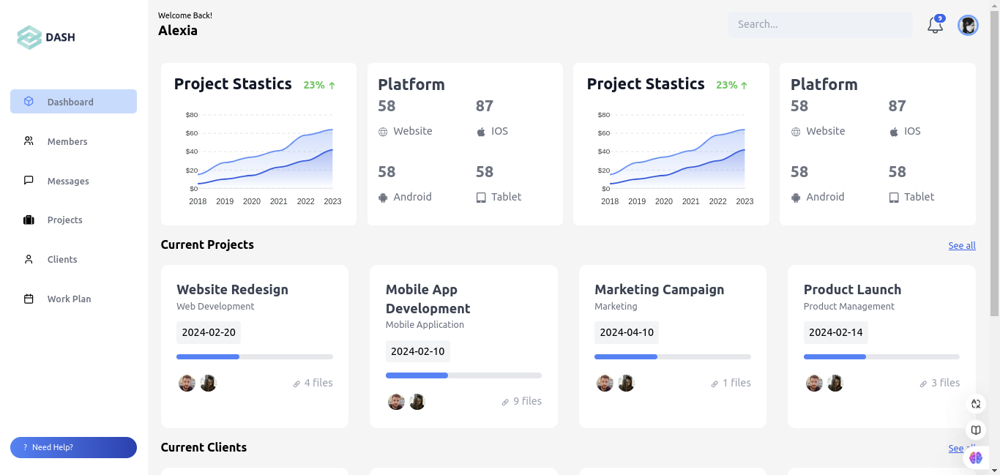

# Dashboard Simples

Este projeto é um **Dashboard Simples**. O objetivo principal é criar uma interface básica que exiba informações organizadas e relevantes, incluindo:

- **Dados principais:** Para apresentar informações resumidas de forma clara.
- **Gráficos simples:**Para visualizar dados de maneira intuitiva.
- **Seções personalizáveis:** Para atender diferentes necessidades.

## Status do Projeto

Layout inicial do dashboard foi desenvolvido, incluindo o menu de navegação e áreas para gráficos.

O projeto é um desafio significativo e está sendo usado como uma oportunidade para:

- Explorar novos conceitos e técnicas do **React**.
- Demonstrar as habilidades que venho adquirindo nos meus estudos.

## Tecnologias Utilizadas

- **React**: Biblioteca principal para a construção da interface.
- **Tailwindcss**
-

## Objetivo Pessoal

Este projeto faz parte do meu portfólio e tem como objetivo demonstrar minha evolução no desenvolvimento de interfaces simples e funcionais.

## Atualizações

O README será atualizado conforme novos recursos forem adicionados ou concluídos.

Acompanhe o progresso e fique à vontade para compartilhar feedback!

---

**Autor:** Eloísa Martins
